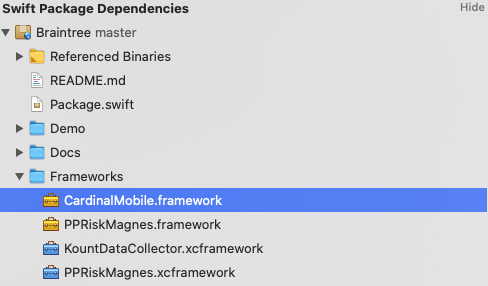
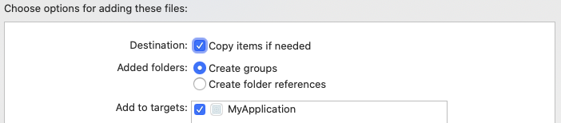
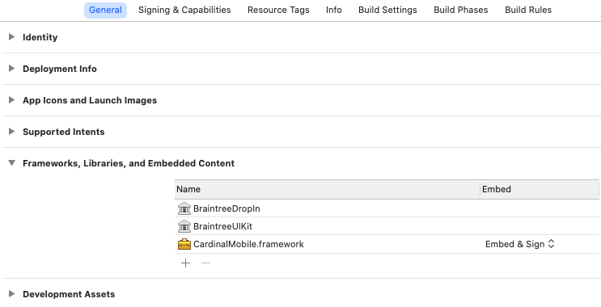

# Braintree iOS Drop-In SDK

[](https://swift.org/package-manager/)
[](https://github.com/Carthage/Carthage)
[](https://cocoapods.org/pods/BraintreeDropIn)


Welcome to Braintree's Drop-In SDK for iOS!


**The Braintree iOS Drop-In SDK requires Xcode 12+**. It permits a deployment target of iOS 12.0 or higher.

## Table of Contents

1. [Getting Started](#getting-started)
1. [Documentation](#documentation)
1. [Versions](#versions)
1. [Demo App](#demo)
1. [Help](#help)
1. [Feedback](#feedback)
1. [License](#license)

## Getting Started

We recommend using [Swift Package Manager](https://swift.org/package-manager/), [CocoaPods](https://github.com/CocoaPods/CocoaPods), or [Carthage](https://github.com/Carthage/Carthage) to integrate the Braintree Drop-In SDK with your project.

### Swift Package Manager (v9 beta)
_This feature is only available in v9.0.0-beta1._

To add the `BraintreeDropIn` package to your Xcode project, select File > Swift Packages > Add Package Dependency and enter `https://github.com/braintree/braintree-ios-drop-in` as the repository URL. Tick the checkbox for `BraintreeDropIn`.

If you look at your app target, you will see that the `BraintreeDropIn` library is automatically linked as a framework to your app (see General > Frameworks, Libraries, and Embedded Content).

The following Braintree Drop-In libraries offer official Swift Package Manager support:
* `BraintreeDropIn`
* `BraintreeUIKit`

To offer ThreeDSecure with `BraintreeDropIn` via SPM, you must manually include the `CardinalMobile.framework`.

#### Manually including the CardinalMobile framework

1. Locate `CardinalMobile.framework` in the Braintree Swift Package dependency.
    <details><summary>Screenshot</summary>
    
    
    
    </details>
1. Right click on the `CardinalMobile.framework` to `Show in Finder`.
1. Drag the `CardinalMobile.framework` into your app's Framework group in Xcode. Check the box to `Copy items if needed`.
    <details><summary>Screenshot</summary>
    
    
    
    </details>
1. Open your project's settings by selecting your app target in the General tab. Under the _Frameworks, Libraries, and Embedded Content_ section, make sure `CardinalMobile.framework` is set to “Embed & Sign”.
    <details><summary>Screenshot</summary>
    
    
    
    </details>

### CocoaPods

Add to your `Podfile`:
```
pod 'BraintreeDropIn'
```
Then run `pod install`.

See our [`Podspec`](https://github.com/braintree/braintree-ios-drop-in/blob/master/BraintreeDropIn.podspec) for more information.

*Note:* If you are using version 8.x.x of the Braintree Drop-In iOS SDK in Xcode 12, you may see the warning `The iOS Simulator deployment target is set to 8.0, but the range of supported deployment target versions is 9.0 to 14.0.99`. This will not prevent your app from compiling. This is a [CocoaPods issue](https://github.com/CocoaPods/CocoaPods/issues/7314) with a known workaround.

### Carthage

Add `github "braintree/braintree-ios-drop-in"` to your `Cartfile`, and [add the frameworks to your project](https://github.com/Carthage/Carthage#adding-frameworks-to-an-application).

You will need the following frameworks at a minimum:

```
BraintreeApplePay.framework
BraintreeDropIn.framework
BraintreeUIKit.framework
BraintreeCard.framework
BraintreeCore.framework
BraintreePaymentFlow.framework
BraintreePayPal.framework
BraintreeThreeDSecure.framework
BraintreeUnionPay.framework
BraintreeVenmo.framework
PayPalDataCollector.framework
PPRiskMagnes.framework
```

For 3DS 2.0, you must add the following framework:

```
CardinalMobile.framework
```

## Documentation

### Import BraintreeDropIn
Add the below import statement to any class where you are using BraintreeDropIn.

```
import BraintreeDropIn
```

### Show Drop-In

Present `BTDropInController` to collect the customer's payment information and receive the `nonce` to send to your server. Saved payment methods will appear if you specified a `customer_id` when creating your client token.

```swift
func showDropIn(clientTokenOrTokenizationKey: String) {
    let request =  BTDropInRequest()
    let dropIn = BTDropInController(authorization: clientTokenOrTokenizationKey, request: request)
    { (controller, result, error) in
        if (error != nil) {
            print("ERROR")
        } else if (result?.isCancelled == true) {
            print("CANCELLED")
        } else if let result = result {
            // Use the BTDropInResult properties to update your UI
            let selectedPaymentOptionType = result.paymentOptionType
            let selectedPaymentMethod = result.paymentMethod
            let selectedPaymentMethodIcon = result.paymentIcon
            let selectedPaymentMethodDescription = result.paymentDescription
        }
        controller.dismiss(animated: true, completion: nil)
    }
    self.present(dropIn!, animated: true, completion: nil)
}
```

### Apple Pay + Drop-In

Apple Pay is enabled by default in Drop-In. Unless you opt out, by setting `showApplePayPaymentOption = false`, Drop-In will show Apple Pay as a payment option as long as it is enabled in the control panel. Below is an example of hiding the Apple Pay button if the device can't make Apple Pay payments using certain card networks:

```swift
let request =  BTDropInRequest()
let canMakePayments = PKPaymentAuthorizationViewController.canMakePayments() && PKPaymentAuthorizationViewController.canMakePayments(usingNetworks: [.amex, .visa, .masterCard])
request.applePayDisabled = !canMakePayments
```

**Important** If your customer selected Apple Pay as their preferred payment method then `result.paymentOptionType == .ApplePay` and the `result.paymentMethod` will be `nil`. Selecting Apple Pay does not display the Apple Pay sheet or create a nonce - you will still need to do that at the appropriate time in your app. Use `BTApplePayClient` to tokenize the customer's Apple Pay information - [view our official docs for more information](https://developers.braintreepayments.com/guides/apple-pay/client-side/ios/v4).

### 3D-Secure + Drop-In

The new Drop-In supports 3D-Secure verification. If you have enabled 3D-Secure in the control panel, enable it in the `BTDropInRequest` and set an amount. Then, create a `BTThreeDSecureRequest` object, setting as many fields on it as possible; the more fields that are set, the less likely it is that a user will be be presented with a challenge. Make sure to attach this object to the `BTDropInRequest` before use.

```swift
let request = BTDropInRequest()
request.threeDSecureVerification = true

let threeDSecureRequest = BTThreeDSecureRequest()
threeDSecureRequest.threeDSecureRequestDelegate = self

threeDSecureRequest.amount = 1.00
threeDSecureRequest.email = "test@example.com"
threeDSecureRequest.requested = .version2

let address = BTThreeDSecurePostalAddress()
address.givenName = "Jill"
address.surname = "Doe"
address.phoneNumber = "5551234567"
address.streetAddress = "555 Smith St"
address.extendedAddress = "#2"
address.locality = "Chicago"
address.region = "IL"
address.postalCode = "12345"
address.countryCodeAlpha2 = "US"
threeDSecureRequest.billingAddress = address

// Optional additional information.
// For best results, provide as many of these elements as possible.
let additionalInformation = BTThreeDSecureAdditionalInformation()
additionalInformation.shippingAddress = address
threeDSecureRequest.additionalInformation = additionalInformation

request.threeDSecureRequest = threeDSecureRequest
```

### Managing payment methods

By default, if you initialize the Drop-in with a client token generated with a customer ID, Drop-in will add payment methods to that customer within the Braintree Vault.  You can optionally allow the deletion of payment methods for that customer by enabling `vaultManager`.

```swift
let request =  BTDropInRequest()
request.vaultManager = true
```

### Fetch last used payment method

If your user already has an existing payment method, you may not need to show the Drop-In payment picker. You can check if they have an existing payment method using `BTDropInResult:fetchDropInResultForAuthorization`. Note that the handler will only return a result when using a client token that was created with a `customer_id`. `BTDropInResult` makes it easy to get a description and icon of the payment method.


```swift
func fetchExistingPaymentMethod(clientToken: String) {
    BTDropInResult.fetch(forAuthorization: clientToken, handler: { (result, error) in
        if (error != nil) {
            print("ERROR")
        } else if let result = result {
            // Use the BTDropInResult properties to update your UI
            let selectedPaymentOptionType = result.paymentOptionType
            let selectedPaymentMethod = result.paymentMethod
            let selectedPaymentMethodIcon = result.paymentIcon
            let selectedPaymentMethodDescription = result.paymentDescription
        }
    })
}
```

### Localization

Drop-In is currently localized for [23 languages](https://github.com/braintree/braintree-ios-drop-in/tree/master/BraintreeUIKit/Localization).

### Color Schemes

Drop-In is fully customizable, but we also provide `Light`, `Dark` and `Dynamic` color schemes. The dynamic color scheme will switch between light and dark based on whether the device is in light or dark mode. The `Dynamic` scheme is only available in iOS 13 or higher. Drop-In will use the `Light` color scheme by default.
```swift
// Set the theme before initializing Drop-In
BTUIKAppearance.sharedInstance().colorScheme = .dynamic
```


### Customization

Use `BTUIKAppearance` to customize the appearance of Drop-In and other BraintreeUIKit classes.
```swift
// Example
BTUIKAppearance.sharedInstance().primaryTextColor = UIColor.green
```

### BraintreeUIKit

`BraintreeUIKit` makes our UI classes public, allowing you to create custom checkout experiences. This includes `localization`, `vector art`, `form fields` and other utils you might need when working with payments. `BraintreeUIKit` has no dependencies on other Braintree frameworks.

```swift
// Example: Get a Visa card icon
let visaIcon = BTUIKPaymentOptionCardView()
visaIcon.paymentOptionType = BTUIKPaymentOptionType.visa

// Example: Create a generic form field and prepare it for autolayout
let favoriteColorFormField = BTUIKFormField()
favoriteColorFormField.translatesAutoresizingMaskIntoConstraints = false
favoriteColorFormField.textField.placeholder = "Favorite Color"
// ... add the form field to your view and use auto layout to position it
```

Take a look at `BTCardFormViewController.m` to see examples of using the form fields and their delegates.

### More Information

Start with [**'Hello, Client!'**](https://developers.braintreepayments.com/ios/start/hello-client) for instructions on basic setup and usage.

Also see our [**reference documentation**](https://braintree.github.io/braintree-ios-drop-in/current/).

## Versions

This SDK abides by our Client SDK Deprecation Policy. For more information on the potential statuses of an SDK check our [developer docs](http://developers.braintreepayments.com/guides/client-sdk/deprecation-policy).

<!-- TODO: Add v9 beta version when ready for release -->
| Major version number | Status | Released | Deprecated | Unsupported |
| -------------------- | ------ | -------- | ---------- | ----------- |
| 8.x.x | Active | Februrary 2020 | TBA | TBA |

## Demo

A demo app is included in this project. To run it, you will need Carthage [0.37.0](https://github.com/Carthage/Carthage):

```
carthage bootstrap --use-xcframeworks --no-use-binaries
open BraintreeDropIn.xcworkspace
```

## Help

* Read the headers
* [Read the docs](https://developers.braintreepayments.com/ios/sdk/client)
* Find a bug? [Open an issue](https://github.com/braintree/braintree-ios-drop-in/issues)
* Want to contribute? [submit a pull request](https://help.github.com/articles/creating-a-pull-request).

## Feedback

The Braintree iOS Drop-In SDK is in active development, we welcome your feedback!

Here are a few ways to get in touch:

* [GitHub Issues](https://github.com/braintree/braintree-ios-drop-in/issues) - For generally applicable issues and feedback
* [Braintree Support](https://help.braintreepayments.com) - For personal support at any phase of integration

## License

The Braintree iOS Drop-In SDK is open source and available under the MIT license. See the [LICENSE](https://github.com/braintree/braintree-ios-drop-in/blob/master/LICENSE) file for more info.
