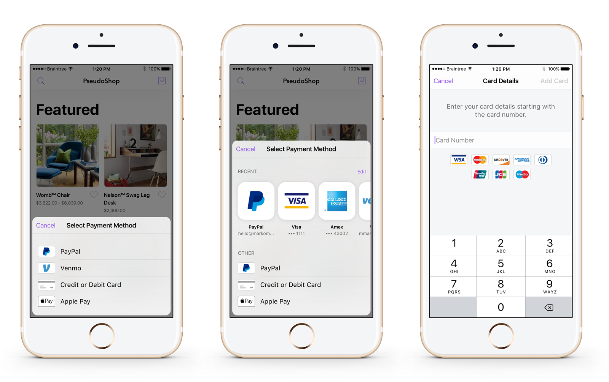
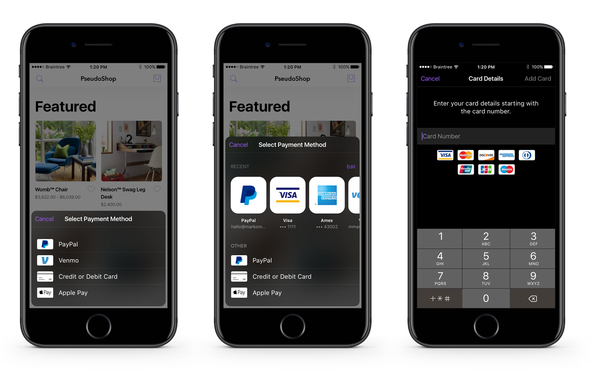

# Braintree iOS Drop-In SDK

[](https://github.com/Carthage/Carthage)

Welcome to Braintree's Drop-In SDK for iOS!



**The Braintree iOS Drop-In SDK requires Xcode 10+ and a Base SDK of iOS 9+**. It permits a Deployment Target of iOS 9.0 or higher.

# What's new
- All new UI and integration for Drop-In
- Fetch a customer's payment method without showing UI
- UI elements, art, helpers and localization are now accessible
- Added Apple Pay and UnionPay support to Drop-In
- Customizable appearance
- card.io card number scanning support
- And more...

Please create an [issue](https://github.com/braintree/braintree-ios-drop-in/issues) with any comments or concerns.

## Getting Started

We recommend using either [CocoaPods](https://github.com/CocoaPods/CocoaPods) or [Carthage](https://github.com/Carthage/Carthage) to integrate the Braintree SDK with your project.

### CocoaPods

Add to your `Podfile`:
```
pod 'BraintreeDropIn'
```
Then run `pod install`.

Customize your integration by specifying additional components. For example, to add Apple Pay support:
```
pod 'BraintreeDropIn'
pod 'Braintree/Apple-Pay'
```

See our [`Podspec`](BraintreeDropIn.podspec) for more information.

### Carthage

Add `github "braintree/braintree-ios-drop-in"` to your `Cartfile`, and [add the frameworks to your project](https://github.com/Carthage/Carthage#adding-frameworks-to-an-application).

You will need the following frameworks at a minimum:

```
BraintreeDropIn.framework
BraintreeUIKit.framework
BraintreeCard.framework
BraintreeCore.framework
BraintreePaymentFlow.framework
BraintreePayPal.framework
PayPalDataCollector.framework
PayPalOneTouch.framework
PayPalUtils.framework
```

For Apple Pay, you must add the following framework in addition to PassKit:

```
BraintreeApplePay.framework
```

For 3DS 2.0, you must add the following framework:

```
CardinalMobile.framework
```

## Documentation

### Import BraintreeDropIn and Braintree
Add the import statements to any class where you are using Braintree.

```
import BraintreeDropIn
import Braintree
```

### Show Drop-In

Present `BTDropInController` to collect the customer's payment information and receive the `nonce` to send to your server. Saved payment methods will appear if you specified a `customer_id` when creating your client token.

```swift
func showDropIn(clientTokenOrTokenizationKey: String) {
    let request =  BTDropInRequest()
    let dropIn = BTDropInController(authorization: clientTokenOrTokenizationKey, request: request)
    { (controller, result, error) in
        if (error != nil) {
            print("ERROR")
        } else if (result?.isCancelled == true) {
            print("CANCELLED")
        } else if let result = result {
            // Use the BTDropInResult properties to update your UI
            let selectedPaymentOptionType = result.paymentOptionType
            let selectedPaymentMethod = result.paymentMethod
            let selectedPaymentMethodIcon = result.paymentIcon
            let selectedPaymentMethodDescription = result.paymentDescription
        }
        controller.dismiss(animated: true, completion: nil)
    }
    self.present(dropIn!, animated: true, completion: nil)
}
```

### Apple Pay + Drop-In

Make sure the following is included in your Podfile:
```
pod 'Braintree/Apple-Pay'
```

Apple Pay is enabled by default in Drop-In. Unless you opt out, by setting `showApplePayPaymentOption = false`, Drop-In will show Apple Pay as a payment option as long as it is enabled in the control panel. Below is an example of hiding the Apple Pay button if the device can't make Apple Pay payments using certain card networks:

```swift
let request =  BTDropInRequest()
let canMakePayments = PKPaymentAuthorizationViewController.canMakePayments() && PKPaymentAuthorizationViewController.canMakePayments(usingNetworks: [.amex, .visa, .masterCard])
request.applePayDisabled = !canMakePayments
```

**Important** If your customer selected Apple Pay as their preferred payment method then `result.paymentOptionType == .ApplePay` and the `result.paymentMethod` will be `nil`. Selecting Apple Pay does not display the Apple Pay sheet or create a nonce - you will still need to do that at the appropriate time in your app. Use `BTApplePayClient` to tokenize the customer's Apple Pay information - [view our official docs for more information](https://developers.braintreepayments.com/guides/apple-pay/client-side/ios/v4).

### 3D-Secure + Drop-In

The new Drop-In supports 3D-Secure verification. If you have enabled 3D-Secure in the control panel, enable it in the `BTDropInRequest` and set an amount. Then, create a `BTThreeDSecureRequest` object, setting as many fields on it as possible; the more fields that are set, the less likely it is that a user will be be presented with a challenge. Make sure to attach this object to the `BTDropInRequest` before use.

```swift
let request = BTDropInRequest()
request.threeDSecureVerification = true

let threeDSecureRequest = BTThreeDSecureRequest()
threeDSecureRequest.threeDSecureRequestDelegate = self

threeDSecureRequest.amount = 1.00
threeDSecureRequest.email = "test@example.com"
threeDSecureRequest.requested = .version2

let address = BTThreeDSecurePostalAddress()
address.givenName = "Jill"
address.surname = "Doe"
address.phoneNumber = "5551234567"
address.streetAddress = "555 Smith St"
address.extendedAddress = "#2"
address.locality = "Chicago"
address.region = "IL"
address.postalCode = "12345"
address.countryCodeAlpha2 = "US"
threeDSecureRequest.billingAddress = address

// Optional additional information.
// For best results, provide as many of these elements as possible.
let additionalInformation = BTThreeDSecureAdditionalInformation()
additionalInformation.shippingAddress = address
threeDSecureRequest.additionalInformation = additionalInformation

request.threeDSecureRequest = threeDSecureRequest
```

### Managing payment methods

By default, if you initialize the Drop-in with a client token generated with a customer ID, Drop-in will add payment methods to that customer within the Braintree Vault.  You can optionally allow the deletion of payment methods for that customer by enabling `vaultManager`.

```swift
let request =  BTDropInRequest()
request.vaultManager = true
```

### Fetch last used payment method

If your user already has an existing payment method, you may not need to show the Drop-In payment picker. You can check if they have an existing payment method using `BTDropInResult:fetchDropInResultForAuthorization`. Note that the handler will only return a result when using a client token that was created with a `customer_id`. `BTDropInResult` makes it easy to get a description and icon of the payment method.


```swift
func fetchExistingPaymentMethod(clientToken: String) {
    BTDropInResult.fetch(forAuthorization: clientToken, handler: { (result, error) in
        if (error != nil) {
            print("ERROR")
        } else if let result = result {
            // Use the BTDropInResult properties to update your UI
            let selectedPaymentOptionType = result.paymentOptionType
            let selectedPaymentMethod = result.paymentMethod
            let selectedPaymentMethodIcon = result.paymentIcon
            let selectedPaymentMethodDescription = result.paymentDescription
        }
    })
}
```

### Localization

Drop-In is currently localized for [23 languages](https://github.com/braintree/braintree-ios-drop-in/tree/master/BraintreeUIKit/Localization).

### card.io

To offer card scanning via card.io, add [card.io](https://github.com/card-io/card.io-iOS-SDK) to your project.

```
//Update your Podfile with card.io
pod 'CardIO'

```
And set `NSCameraUsageDescription` in your application's plist.

```
<key>NSCameraUsageDescription</key>
<string>To offer card scanning via card.io</string>
```

### Themes

Drop-In is fully customizable, but we also provide `Light` and `Dark` themes. Drop-In will use the `Light` theme by default.
```swift
// Set the theme before initializing Drop-In
BTUIKAppearance.darkTheme()
```



### Customization

Use `BTUIKAppearance` to customize the appearance of Drop-In and other BraintreeUIKit classes.
```swift
// Example
BTUIKAppearance.sharedInstance().primaryTextColor = UIColor.green
```

### BraintreeUIKit

`BraintreeUIKit` is our new framework that makes our UI classes public allowing you to create custom checkout experiences. This includes `localization`, `vector art`, `form fields` and other utils you might need when working with payments. `BraintreeUIKit` has no dependencies on other Braintree frameworks.

To get the standalone `BraintreeUIKit` framework, add the following to your Podfile:
```
pod 'BraintreeDropIn/UIKit'
```

```swift
// Example: Get a Visa card icon
let visaIcon = BTUIKPaymentOptionCardView()
visaIcon.paymentOptionType = BTUIKPaymentOptionType.visa

// Example: Create a generic form field and prepare it for autolayout
let favoriteColorFormField = BTUIKFormField()
favoriteColorFormField.translatesAutoresizingMaskIntoConstraints = false
favoriteColorFormField.textField.placeholder = "Favorite Color"
// ... add the form field to your view and use auto layout to position it
```

Take a look at `BTCardFormViewController.m` to see examples of using the form fields and their delegates.

### URL Query Scheme Whitelist

If your app is compiled with iOS 9 SDK and integrates payment options with an app-switch workflow (Venmo, PayPal), you must add URL schemes to the whitelist in your application's plist.

If your app supports payments from PayPal:
* `com.paypal.ppclient.touch.v1`
* `com.paypal.ppclient.touch.v2`

If your app supports payments from Venmo:
* `com.venmo.touch.v2`

For example, if your app supports PayPal, you could add the following:
```
  <key>LSApplicationQueriesSchemes</key>
  <array>
    <string>com.paypal.ppclient.touch.v1</string>
    <string>com.paypal.ppclient.touch.v2</string>
  </array>
```

There is a new `UIApplicationDelegate` method that you may implement on iOS 9:
```
- (BOOL)application:(UIApplication *)app openURL:(NSURL *)url options:(NSDictionary<NSString*, id> *)options
```
Implementing this method is optional. If you do not implement it, the deprecated equivalent will still be called; otherwise, it will not.

In either case, you still need to implement the deprecated equivalent in order to support iOS 8 or earlier:
```
- (BOOL)application:(UIApplication *)application openURL:(NSURL *)url sourceApplication:(NSString *)sourceApplication annotation:(id)annotation
```

### More Information

Start with [**'Hello, Client!'**](https://developers.braintreepayments.com/ios/start/hello-client) for instructions on basic setup and usage.

Next, read the [**full documentation**](https://developers.braintreepayments.com/ios/sdk/client) for information about integration options, such as Drop-In UI, custom payment button, and credit card tokenization.

## Demo

A demo app is included in project. To run it, run `pod install` and then open `BraintreeDropIn.xcworkspace` in Xcode.

## Help

* Read the headers
* [Read the docs](https://developers.braintreepayments.com/ios/sdk/client)
* Find a bug? [Open an issue](https://github.com/braintree/braintree_ios/issues)
* Want to contribute? [Check out contributing guidelines](CONTRIBUTING.md) and [submit a pull request](https://help.github.com/articles/creating-a-pull-request).

## Feedback

The Braintree iOS Drop-In SDK is in active development, we welcome your feedback!

Here are a few ways to get in touch:

* [GitHub Issues](https://github.com/braintree/braintree-ios-drop-in/issues) - For generally applicable issues and feedback
* [Braintree Support](https://articles.braintreepayments.com/) / support@braintreepayments.com - for personal support at any phase of integration


## Releases

Subscribe to our [Google Group](https://groups.google.com/forum/#!forum/braintree-sdk-announce) to
be notified when SDK releases go out.

## License

The Braintree iOS Drop-In SDK is open source and available under the MIT license. See the [LICENSE](LICENSE) file for more info.
