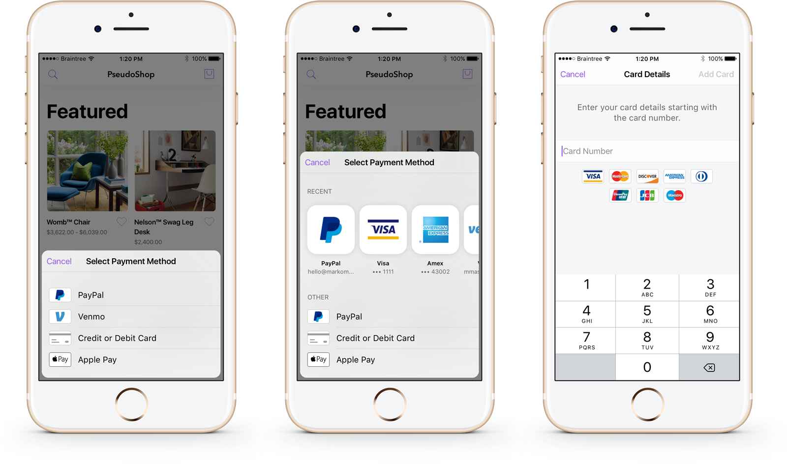
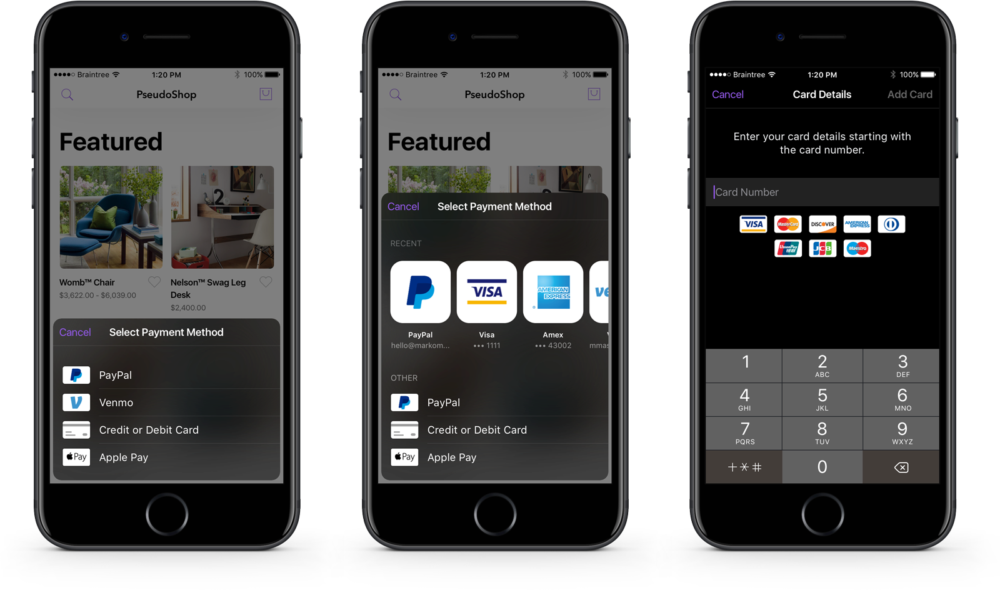

# Braintree iOS Drop-in SDK

[](https://swift.org/package-manager/)
[](https://cocoapods.org/pods/BraintreeDropIn)


Welcome to Braintree's Drop-in SDK for iOS!



**The Braintree iOS Drop-in SDK permits a deployment target of iOS 12.0 or higher.** It requires Xcode 12+ and Swift 5.1+.

## Table of Contents

1. [Getting Started](#getting-started)
1. [Documentation](#documentation)
1. [Versions](#versions)
1. [Demo App](#demo)
1. [Help](#help)
1. [Feedback](#feedback)
1. [License](#license)

## Getting Started

We recommend using [Swift Package Manager](https://swift.org/package-manager/) or [CocoaPods](https://github.com/CocoaPods/CocoaPods) to integrate the Braintree Drop-in SDK with your project.

### Swift Package Manager
_This feature is only available in v9._

To add the `BraintreeDropIn` package to your Xcode project, select File > Swift Packages > Add Package Dependency and enter `https://github.com/braintree/braintree-ios-drop-in` as the repository URL. Tick the checkbox for `BraintreeDropIn`.

If you look at your app target, you will see that the `BraintreeDropIn` library is automatically linked as a framework to your app (see General > Frameworks, Libraries, and Embedded Content).


_Note_: There is a [known SPM issue](https://forums.swift.org/t/swift-package-binary-framework-issue/41922) for apps with app extensions that use Swift Packages with binary dependencies. The issue occurs when uploading a build to App Store Connect. You can read the report on Swift Forums and follow [this workaround](https://github.com/braintree/braintree-ios-drop-in/issues/317#issuecomment-815005747).

### CocoaPods

Add to your `Podfile`:
```
pod 'BraintreeDropIn'
```
Then run `pod install`.

See our [`Podspec`](https://github.com/braintree/braintree-ios-drop-in/blob/master/BraintreeDropIn.podspec) for more information.

*Note:* If you are using version 8.x.x of the Braintree Drop-in iOS SDK in Xcode 12, you may see the warning `The iOS Simulator deployment target is set to 8.0, but the range of supported deployment target versions is 9.0 to 14.0.99`. This will not prevent your app from compiling. This is a [CocoaPods issue](https://github.com/CocoaPods/CocoaPods/issues/7314) with a known workaround.

## Documentation

### Import BraintreeDropIn
Add the below import statement to any class where you are using BraintreeDropIn.

```
import BraintreeDropIn
```

### Show Drop-in

Present `BTDropInController` to collect the customer's payment information and receive the `nonce` to send to your server. Saved payment methods will appear if you specified a `customer_id` when creating your client token.

```swift
func showDropIn(clientTokenOrTokenizationKey: String) {
    let request =  BTDropInRequest()
    let dropIn = BTDropInController(authorization: clientTokenOrTokenizationKey, request: request)
    { (controller, result, error) in
        if (error != nil) {
            print("ERROR")
        } else if (result?.isCanceled == true) {
            print("CANCELED")
        } else if let result = result {
            // Use the BTDropInResult properties to update your UI
            let selectedPaymentMethodType = result.paymentMethodType
            let selectedPaymentMethod = result.paymentMethod
            let selectedPaymentMethodIcon = result.paymentIcon
            let selectedPaymentMethodDescription = result.paymentDescription
        }
        controller.dismiss(animated: true, completion: nil)
    }
    self.present(dropIn!, animated: true, completion: nil)
}
```

### Apple Pay + Drop-in

Apple Pay is enabled by default in Drop-in. Drop-in will show Apple Pay as a payment option as long as it is enabled in the control panel and the device supports it. To opt out, set `applePayDisabled = true` on your `BTDropInRequest`.

**Important:** If your customer selects Apple Pay as their preferred payment method then `result.paymentMethodType == .applePay` and the `result.paymentMethod` will be `nil`. Selecting Apple Pay does not display the Apple Pay sheet or create a nonce. After you receive the `BTDropInResult`, you will need to:
1) Display a `PKPaymentButton`.
2) Present a `PKPaymentAuthorizationViewController` when the customer taps the button.
3) Tokenize the `PKPayment` and send the resulting nonce to your server to create a transaction.

Use `BTApplePayClient` to tokenize the customer's Apple Pay information - [view our official docs for more information](https://developers.braintreepayments.com/guides/apple-pay/client-side/ios/v5).

### 3D Secure + Drop-in

The Drop-in supports 3D Secure verification. You must have 3D Secure enabled in the Control Panel. Create a `BTThreeDSecureRequest`, setting as many fields on it as possible; the more fields that are set, the less likely it is that a user will be be presented with a challenge. Set the `BTThreeDSecureRequest` on `BTDropInRequest`.

```swift
let request = BTDropInRequest()

let threeDSecureRequest = BTThreeDSecureRequest()
threeDSecureRequest.threeDSecureRequestDelegate = self

threeDSecureRequest.amount = 1.00
threeDSecureRequest.email = "test@example.com"
threeDSecureRequest.requested = .version2

let address = BTThreeDSecurePostalAddress()
address.givenName = "Jill"
address.surname = "Doe"
address.phoneNumber = "5551234567"
address.streetAddress = "555 Smith St"
address.extendedAddress = "#2"
address.locality = "Chicago"
address.region = "IL"
address.postalCode = "12345"
address.countryCodeAlpha2 = "US"
threeDSecureRequest.billingAddress = address

// Optional additional information.
// For best results, provide as many of these elements as possible.
let additionalInformation = BTThreeDSecureAdditionalInformation()
additionalInformation.shippingAddress = address
threeDSecureRequest.additionalInformation = additionalInformation

request.threeDSecureRequest = threeDSecureRequest
```

### Managing payment methods

By default, if you initialize the Drop-in with a client token generated with a customer ID, Drop-in will add payment methods to that customer within the Braintree Vault.  You can optionally allow the deletion of payment methods for that customer by enabling `vaultManager`.

```swift
let request =  BTDropInRequest()
request.vaultManager = true
```

### Fetch most recent payment method

If your user already has an existing payment method, you may not need to show the Drop-in UI. You can check if they have an existing payment method using `BTDropInResult.mostRecentPaymentMethod`. Note that you must use a client token that was created with a `customer_id`. `BTDropInResult` makes it easy to get a description and icon of the payment method.


```swift
BTDropInResult.mostRecentPaymentMethod(forClientToken: authorization) { result, error in
  guard let result = result, error == nil else {
    // either an error occurred or the customer doesn't have any vaulted payment methods
    return
  }

  if result.paymentOptionType == .applePay {
    // Apple Pay is the most recently selected option
    // Note that result.paymentMethod will be nil in this case; display Apple Pay button and tokenize using `BTApplePayClient`
  }

  // Update your UI
  let type = result.paymentMethodType
  let icon = result.paymentIcon
  let description = result.paymentDescription

  // Use the payment method to transact
  let paymentMethod = result.paymentMethod
}
```

### Localization

Drop-in is currently localized for [22 languages](https://github.com/braintree/braintree-ios-drop-in/tree/master/Sources/BraintreeDropIn/Resources).

### Color Schemes

Drop-in is fully customizable, but we also provide `Light`, `Dark` and `Dynamic` color schemes. The dynamic color scheme will switch between light and dark based on whether the device is in light or dark mode. The `Dynamic` scheme is only available in iOS 13 or higher. Drop-in will use the `Light` color scheme by default.
```swift
let uiCustomization = BTDropInUICustomization(colorScheme: .dark)

let dropInRequest = BTDropInRequest()
dropInRequest.uiCustomization = uiCustomization
```



### Customization

Use `BTDropInUICustomization` to customize the appearance of Drop-in.

```swift
let uiCustomization = BTDropInUICustomization(colorScheme: .dynamic)
uiCustomization.fontFamily = "Helvetica"
uiCustomization.boldFontFamily = "Helvetica Bold"

let dropInRequest = BTDropInRequest()
dropInRequest.uiCustomization = uiCustomization
```

### Accessibility

#### Dynamic Type

Dynamic type is enabled by default for both system and custom fonts. We strongly encourage you to leave this feature on, but if you wish to disable it, you may do so by setting `disableDynamicType` to `true` on `BTDropInUICustomization`.

```swift
let uiCustomization = BTDropInUICustomization(colorScheme: .light)
uiCustomization.disableDynamicType = true

let dropInRequest = BTDropInRequest()
dropInRequest.uiCustomization = uiCustomization
```

#### VoiceOver

Drop-in UI elements support VoiceOver.

#### SwiftUI

Drop-in does not officially support SwiftUI at this time.

### More Information

Start with [**'Hello, Client!'**](https://developers.braintreepayments.com/ios/start/hello-client) for instructions on basic setup and usage.

Also see our [**reference documentation**](https://braintree.github.io/braintree-ios-drop-in/current/).

## Versions

This SDK abides by our Client SDK Deprecation Policy. For more information on the potential statuses of an SDK check our [developer docs](http://developers.braintreepayments.com/guides/client-sdk/deprecation-policy).
| Major version number | Status | Released | Deprecated | Unsupported |
| -------------------- | ------ | -------- | ---------- | ----------- |
| 9.x.x | Active | April 2021 | TBA | TBA |
| 8.x.x | Inactive | Februrary 2020 | April 2022 | TBA |
| 7.x.x | Deprecated | December 2018 | April 2021 | April 2022 |

Versions 6 and below are unsupported.

## Demo

A demo app is included in this project. Open BraintreeDropIn.xcworkspace and run the Demo scheme to view it.

The demo app uses Swift Package Manager to fetch dependencies. Xcode will download dependencies automatically when you open the workspace. Deleting derived data will delete the dependencies. Go to **File -> Swift Packages -> Resolve Package Versions** to re-download them.

## Help

* Read the headers
* [Read the docs](https://developers.braintreepayments.com/ios/sdk/client)
* Find a bug? [Open an issue](https://github.com/braintree/braintree-ios-drop-in/issues)
* Want to contribute? [submit a pull request](https://help.github.com/articles/creating-a-pull-request).

## Feedback

The Braintree iOS Drop-in SDK is in active development, we welcome your feedback!

Here are a few ways to get in touch:

* [GitHub Issues](https://github.com/braintree/braintree-ios-drop-in/issues) - For generally applicable issues and feedback
* [Braintree Support](https://help.braintreepayments.com) - For personal support at any phase of integration

## License

The Braintree iOS Drop-in SDK is open source and available under the MIT license. See the [LICENSE](https://github.com/braintree/braintree-ios-drop-in/blob/master/LICENSE) file for more info.
